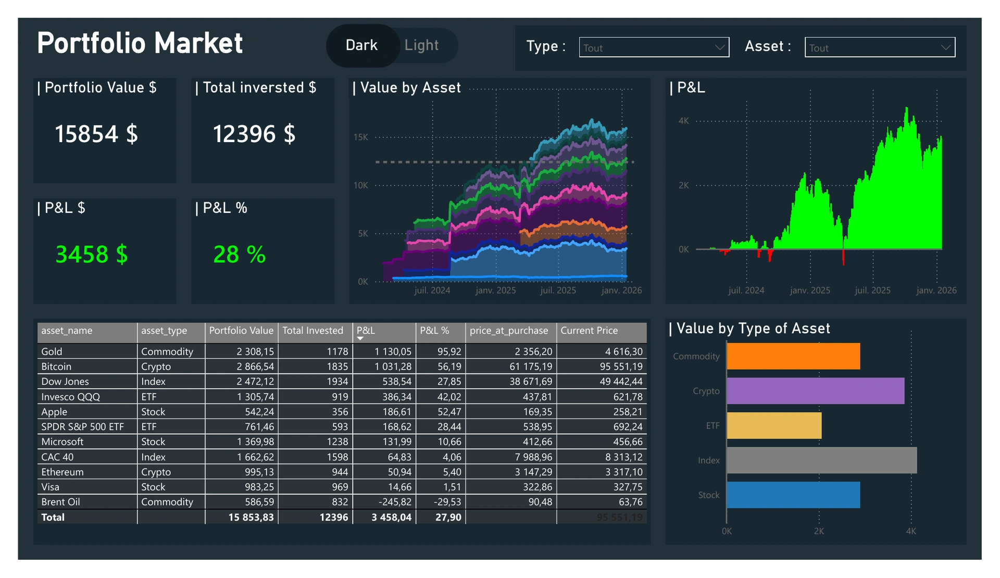
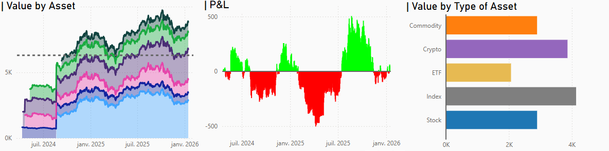

# Multi-Asset Portfolio Dashboard

This project showcases a fully interactive portfolio dashboard built in Power BI, powered by Python for automated data retrieval. It allows you to monitor your investments across multiple asset classes in real time, with clear visualizations and insights.

## Project Overview

The dashboard tracks:

- Stocks, ETFs, indices, cryptocurrencies, and commodities.
- Portfolio value and P&L over time.
- Asset breakdown by type and individual assets.

All financial data is automatically fetched from Yahoo Finance, cleaned, and structured to provide an accurate, up-to-date portfolio view.

## Key Features

- **Automated Data Updates:** Python scripts fetch daily prices for all assets.
- **Portfolio Management:** Add or remove assets, and automatically track your invested value.
- **Dynamic Visualizations:** Easily analyze portfolio value and performance over time.
- **Exportable Insights:** Save your dashboards as PDFs or interactive reports.

## Screenshots

## How to Use

1. **Update data and manage your portfolio**  
   - Run the `update_data.bat` file.  
   - This script fetches the latest prices from Yahoo Finance and allows you to add or remove assets from your portfolio. (The list of available assets is in `asset_code.txt`.)  
   - Run this at least once per day to ensure your data is up to date.

2. **Open the Power BI dashboard**  
   - Launch `dashboards/PortfolioDashboard.pbix` in Power BI Desktop.  
   - Press the **Refresh** button to load the latest data.
